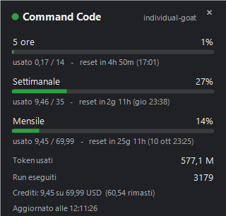
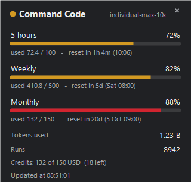
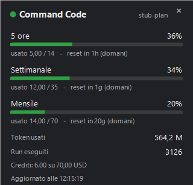
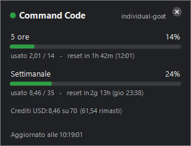
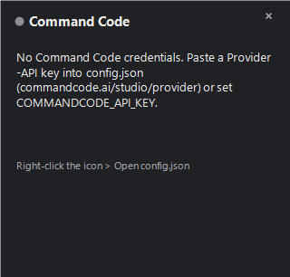
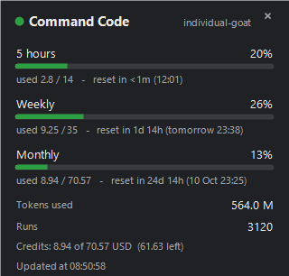
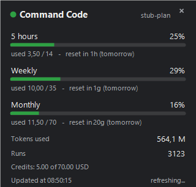

# CommandCode Tray Meter

[](#)
[](#)
[](#)
[](#)
[](#tests)
[](#)

[](https://github.com/standardbus/CommandCode-Tray-Meter/releases/latest)
[](https://github.com/standardbus/CommandCode-Tray-Meter/stargazers)
[](https://github.com/standardbus/CommandCode-Tray-Meter/commits)
[](https://github.com/standardbus/CommandCode-Tray-Meter)

A minimal usage monitor for **Command Code**: a Windows notification-area icon
(next to the clock) that shows how much of each limit window you have consumed,
with a graphical bubble that **opens instantly** and keeps updating while it stays
on screen. On Linux and macOS the same readings are available as a terminal
meter, `ccmeter`.

> **[Download the executable](https://github.com/standardbus/CommandCode-Tray-Meter/releases/latest)**
> — a single 78 KB file, no runtime to install — or the
> [terminal meter](https://github.com/standardbus/CommandCode-Tray-Meter/releases/latest)
> for Linux and macOS.

Three ways to run it, sharing the same `config.json`, the same credentials and
the same numbers:

| | **Executable** | **Scripts** | **Terminal meter** |
|---|---|---|---|
| Files | `CommandCodeMonitor.exe` (78 KB) | `src/tray.ps1` + `src/session.mjs` | `bin/ccmeter` |
| Platform | Windows 10/11 | Windows 10/11 | Linux and macOS |
| Requires | nothing else | Node.js 18+ and PowerShell | Node.js 18+ |
| Logic | C# (`csharp/`) | Node (`src/`) | Node (`src/`) |
| For | a tray icon from one file | changing the tray code | servers, tmux, status bars |

---

## Screenshots

| Limit bubble | Warning and critical colours | Live update |
|---|---|---|
|  |  |  |

| Close button (the x highlights) | No credentials yet | Rendering from the executable |
|---|---|---|
|  |  |  |

The two rolling windows are shown immediately; the rest of the bubble fills in
while it is already on screen — on the left the freshly read value, on the right
the hydrated one.

| Before hydration | After hydration |
|---|---|
|  |  |

---

## Quick start (executable)

```powershell
# 1. download CommandCodeMonitor.exe from the release, or build it:
powershell -NoProfile -ExecutionPolicy Bypass -File scripts\build-exe.ps1

# 2. put the key into the configuration
notepad config.json          # paste your Provider-API key into "apiKey"

# 3. run it
.\CommandCodeMonitor.exe
```

`CommandCodeMonitor.exe` and `config.json` in the same folder are all you need:
**no runtime to install**, no companion script, nothing to unpack. The executable
is compiled with the C# compiler bundled with .NET Framework 4.8, which is
present on every Windows 10 and 11 machine.

Useful commands:

```powershell
.\CommandCodeMonitor.exe --selftest          # offline checks, exit 0 when everything passes
.\CommandCodeMonitor.exe --render out.png    # draw the bubble into a PNG
.\CommandCodeMonitor.exe --demo              # open the bubble by itself, then exit
.\CommandCodeMonitor.exe --help
```

Start-at-login is enabled from the **Start with Windows** entry in the icon menu
(it writes to `HKCU\...\CurrentVersion\Run`, no privileges required).

---

## Quick start (scripts)

The script implementation needs Node.js 18+; PowerShell 5.1 already ships with
Windows.

```powershell
Copy-Item config.example.json config.json
notepad config.json          # paste your key
npm start
```

---

## Quick start (Linux and macOS)

The terminal meter needs Node.js 18 or newer and nothing else: no build step, no
dependencies, no daemon.

```bash
# 1. download commandcode-meter-linux.tar.gz (or -macos) from the release
tar -xzf commandcode-meter-*.tar.gz
cd commandcode-meter

# 2. put the key into the configuration
cp config.example.json config.json
$EDITOR config.json          # paste your Provider-API key into "apiKey"

# 3. run it
./bin/ccmeter
```

```
Command Code · individual-goat

  5 hours  18%  ████░░░░░░░░░░░░░░░░  2.57 / 14      reset in 2h 21m (12:01)
  Weekly   56%  ███████████░░░░░░░░░  19.45 / 35     reset in 1d 13h (tomorrow 23:38)
  Monthly  28%  ██████░░░░░░░░░░░░░░  19.39 / 69.95  reset in 24d 13h (10 Oct 23:25)

  Tokens   1.14 B
  Runs     5977
  Credits  19.39 of 69.95 USD  (50.55 left)
  Updated  09:39:52
```

Useful options:

```bash
./bin/ccmeter --watch            # redraw on the configured interval
./bin/ccmeter --watch 30         # ...or on one you choose
./bin/ccmeter --compact          # one line, for a tmux status bar or a prompt
./bin/ccmeter --json             # the raw payload, for scripting
./bin/ccmeter --profile work     # only this account (repeatable)
./bin/ccmeter --list-profiles    # the configured account ids
./bin/ccmeter --language it      # en, it or zh, overriding the configuration
./bin/ccmeter --auth-only        # which credential source was found, no network call
./bin/ccmeter --help
```

With `--compact` you get a single line you can drop into a status bar:

```
CC 5h 18% · 7d 56% · 30d 28% · 1.14 B · 5977
```

To have `ccmeter` on your `PATH`, symlink it rather than moving it, so the
relative imports keep resolving:

```bash
ln -s "$PWD/bin/ccmeter" ~/.local/bin/ccmeter
```

Colours follow the same thresholds as the tray (green below 60%, amber from 60%,
red from 85%) and are emitted only when stdout is a terminal; `NO_COLOR=1` or
`--no-color` turns them off, and `--ascii` draws the bars with `#` and `-`
instead of blocks. Exit codes: `0` for data or a non-fatal provider error, `2`
when authentication is needed, `3` when the command could not run at all.

The same payload powers all three implementations: `ccmeter` and the Windows
tray import the same `src/limits.mjs`, so a value cannot be computed two
different ways.

> The tray icon itself is Windows-only: it is built on WinForms, the Windows
> notification area and global mouse hooks. A native menu-bar equivalent for
> Linux and macOS is a separate piece of work, not a port of this one.

---

## What it shows


| Element | Meaning |
|---|---|
| Icon **ring** | the window selected by `ui.iconMetric` (default: 5 hours) |
| **Dot** in the bottom-right corner | percentage used of the **weekly** window |
| Bubble header | active plan and the close button (the x in the top-right corner) |
| **5 hours** bar | `used / cap`, percentage and reset (`in 3h 12m (20:00)`) |
| **Weekly** bar | same, against the 7-day cap |
| **Monthly** bar | billing-cycle credit, with the renewal date |
| **Tokens used** | cycle total (`564.0 M`) |
| **Runs** | number of executions in the cycle (`3120`) |
| **Credits** row | spent against available, in USD, with what is left |
| **Accounts** section | one row per other account, shown only when `profiles` lists more than one |

Colours follow configurable thresholds: **green** below 60%, **amber** from 60%,
**red** from 85%.

### Where every number comes from

Everything comes from the four calls the monitor already makes; no value is
invented or estimated.

| Value | Source |
|---|---|
| 5 hours, weekly | `windowLimits.fiveHour` / `.weekly` from `/alpha/billing/credits` |
| Monthly | **derived**: cycle spend (`totalCost` from `/alpha/usage/summary`) plus what is left in the pools from `/alpha/billing/credits` gives the monthly ceiling |
| Tokens, runs | `totalTokens` and `totalCount` from `/alpha/usage/summary` |
| Monthly reset | `currentPeriodEnd` from `/alpha/billing/subscriptions` |

The monthly window does not exist in the API: it is **derived**, and both the
Node tests and the executable self-test compare it against the value Command Code
Studio shows for the same account.

### Closing the bubble

The bubble closes in three ways, all equivalent:

- the **x** in the top-right corner (it highlights on hover);
- a **click outside** the bubble, anywhere on screen;
- the **Esc** key.

Both implementations install a global `WH_MOUSE_LL` hook while the bubble is
open, because a borderless window never receives clicks that land elsewhere and
never takes mouse capture. The hook is removed on close.

### Why opening is instant

The two rolling windows come from a single fast call (about 50 ms), while the
USD credits row needs two slow calls (`subscriptions` around 1500 ms and
`usage/summary` around 700-1500 ms). The monitor shows the windows immediately
from the value it already has and **hydrates the rest afterwards**, while the
bubble is already on screen: opening stays under 150 ms instead of waiting for
the 2.5-second tail.

---

## Configuration

Every key is optional except `apiKey` in a single-account configuration. The same
keys apply to the executable, the tray scripts and the terminal meter.

| Key | Default | Description |
|---|---|---|
| `apiKey` | `""` | Provider-API key of the single account |
| `apiKeyEnv` | `COMMANDCODE_API_KEY` | environment variable the single account reads its key from |
| `profiles` | `[]` | several accounts to monitor, see [Accounts](#accounts) |
| `activeProfile` | first account | account the tray icon follows |
| `language` | `en` | interface language: `en`, `it`, `zh` or `auto` |
| `endpoints.baseUrl` | `https://api.commandcode.ai` | canonical host |
| `endpoints.*Path` | `/alpha/...` | per-endpoint overrides |
| `refreshSeconds` | `120` | background polling interval (minimum 15) |
| `thresholds.warn` | `60` | amber threshold |
| `thresholds.critical` | `85` | red threshold |
| `ui.iconMetric` | `fiveHour` | window followed by the ring: `fiveHour`, `weekly`, `monthly` |
| `ui.monochrome` | `false` | grey icon |
| `ui.showTooltip` | `true` | tooltip on the icon |
| `requestTimeoutMs` | `8000` | request timeout |

> `ui.iconMetric` is read at startup: restart the monitor after changing it.

> **Note:** `/alpha/*` is not publicly documented and may change without notice.
> That is why every path can be overridden from `config.json` under `endpoints`:
> if Command Code changes something, you fix the JSON without touching the code.

### Accounts

Monitoring several Command Code accounts means listing them under `profiles`.
Each entry needs an `id` (lower-case letters, digits and hyphens, unique) and a
key, either inline or named through an environment variable:

```json
{
  "profiles": [
    { "id": "personal", "name": "Personal", "apiKey": "user_..." },
    { "id": "work", "name": "Work", "apiKeyEnv": "COMMANDCODE_API_KEY_WORK" }
  ],
  "activeProfile": "personal"
}
```

- **The tray icon follows the active account** — `activeProfile` if it names one,
  otherwise the first entry. The **Account** submenu switches it, and the choice
  is remembered in `.cache`, never written back into `config.json`.
- **The bubble shows every account**: the active one in full, then a row per
  other account, and the panel grows to fit.
- **`ccmeter` prints one block per account**, or a single line per account with
  `--compact`; `--profile work` narrows it to one and `--list-profiles` prints
  the ids.
- **A named account uses only its own key.** An ambient `COMMANDCODE_API_KEY`
  does not stand in for it, because silently monitoring the wrong account is
  worse than an error that names it. Only a configuration *without* `profiles`
  keeps the ambient-first lookup below.
- One account failing never hides the others: each carries its own state.

A configuration without `profiles` behaves exactly as it always did: one account,
`apiKey` plus the lookup order below.

### Languages

The interface ships in **English, Italian and Chinese**; the tables are
`lang/en.json`, `lang/it.json` and `lang/zh.json`, and every surface reads the
same ones — the executable compiles them in at build time, the tray and the
terminal meter load them at runtime.

```json
{ "language": "it" }
```

`language` accepts `en`, `it`, `zh`, or `auto` to follow the operating system
locale. `ccmeter --language zh` overrides it for one run. Dates, numbers and the
token suffixes follow the language (`8,45` and `Mld` in Italian, `8.45` and `B` in
English), and Chinese falls back to a CJK-capable font.

### Credentials

Lookup order:

1. the `COMMANDCODE_API_KEY` environment variable
2. `apiKey` in `config.json`
3. `~/.commandcode/auth.json` (keys `command-code` / `commandcode` / `apiKey`)
4. `~/.pi/agent/auth.json` (only `command-code` / `commandcode`)

Files 3 and 4 are **read and never written**: token renewal belongs to the CLI
that owns the file, and rewriting it from here would corrupt state shared with
the other tools on the machine. An expired token is reported, not force-renewed.

If you install the Command Code CLI, the monitor finds it on its own with no
changes.

> `config.json` holds a key: **never commit it**. It is already in `.gitignore`,
> and the repository only ships `config.example.json` with the field empty.

---

## Building the executable

```powershell
powershell -NoProfile -ExecutionPolicy Bypass -File scripts\build-exe.ps1
```

The script generates the icon from source (`scripts/make-icon.ps1`), compiles
`csharp/*.cs` into `CommandCodeMonitor.exe` and runs the self-test. Options:
`-SkipSelfTest`, `-OutputPath`.

The icon is drawn with GDI+ during the build rather than committed as a binary
file: the repository carries no asset nobody can regenerate.

---

## Tests

```powershell
npm test              # Node + Pester suites (tray and terminal meter)
npm run test:node     # logic, credentials, accounts, languages, CLI (120 tests)
npm run test:pester   # drawing, thresholds, closing and icon (32 tests)
npm run build:exe     # builds the executable and runs its self-test (13 checks)
```

The Node suite is the one that runs on Linux and macOS too, which is how
`bin/ccmeter` is covered: its layout lives in `src/render.mjs` as pure functions,
so the tests never need a terminal.

To try everything **without credentials**, using a local server that mimics the
API and increments the values on every request:

```powershell
npm run fixture
node src\fetch.mjs --url http://127.0.0.1:8787 --pretty
npm run test:live
```

The same fixture works for the terminal meter:

```bash
node scripts/fixture-server.mjs --mode grow &
./bin/ccmeter --url http://127.0.0.1:8787
```

---

## Troubleshooting

**The icon does not appear.** On Windows 11 look in the hidden flyout (`^`): drag
it out once and Windows remembers the position. For the executable, check that you
launched it with `config.json` in the same folder.

**"Authentication required" in the bubble.** The key is missing or was rejected.
Check `apiKey`, then run `CommandCodeMonitor.exe --selftest` (or
`node src\fetch.mjs --pretty`) for the exact error. A `401`/`403` is treated as
final: the monitor does not retry blindly.

**"Not updated".** The network or the API is not responding: the bubble keeps
showing the last good values.

**Only one icon, always.** The executable uses a named mutex, the script version
a file lock: a second instance exits immediately. If you are sure otherwise, close
everything and delete `.cache\session.lock`.

**Values frozen.** Limits only move when you use Command Code: the windows start
at the first request and stay at zero until then.

---

## Layout

```
CommandCodeMonitor.exe     the executable: everything is in here
config.example.json        configuration template
bin/ccmeter                terminal meter for Linux and macOS
lang/                      interface tables: en.json, it.json, zh.json
csharp/                    C# sources of the executable
src/                       shared limits logic (limits.mjs), languages (i18n.mjs),
                           CLI rendering (render.mjs) and the PowerShell tray
scripts/                   build, icon, autostart, self-test, fixture server
test/                      Node + Pester suites and the live harness
screenshots/               images used by this README
```

All three implementations share `config.json`, the credential lookup and the
number formatting; the executable self-test compares its values against the ones
the Node version produces from the same payload, and `ccmeter` imports the same
`limits.mjs` the tray uses, so none of them can silently diverge.

---

## Uninstalling

For the executable: quit from the icon menu, turn off **Start with Windows**, then
delete the folder. No registry changes, no service installed.

For the script version:

```powershell
npm run autostart:off
Remove-Item -Recurse -Force .cache
```

For the terminal meter: delete the extracted folder, and the symlink if you made
one. It writes nothing outside it.
